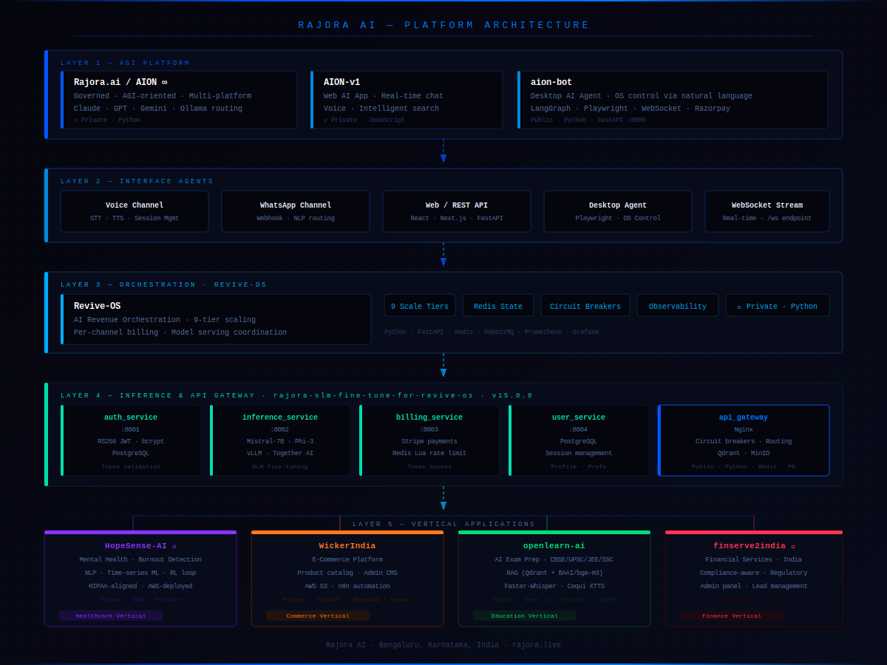

 

*One infrastructure. Every vertical. No rebuilding the plumbing.*

 

---

*Agentic AI platform built by one engineer in Bengaluru — production-deployed, multi-model, infrastructure-first.*

---

## What is Rajora AI?

Rajora AI is an AI infrastructure company based in Bengaluru, India. We build the foundational stack — orchestration, inference, auth, billing, model routing, and automation — so that domain-specific AI products can be launched without rebuilding the same foundation from scratch every time.

Every product we ship — from mental health analytics to e-commerce automation to exam preparation — runs on the same battle-tested core. LangGraph is the orchestration backbone. Claude, GPT-4, Gemini, and Ollama are model targets — routed dynamically by cost, capability, and latency at runtime. No vendor lock-in. No hardcoded dependencies.

**The problem we solve:** Most AI products spend the majority of their engineering time on infrastructure that has nothing to do with their domain — auth systems, billing logic, rate limiting, model serving, API key management. We built that once. Made it reusable. Then deployed it across 13 real repositories and multiple live production products.

---

## Platform Architecture

---

## Core Products

### 🧠 AION ∞ — Agentic Intelligence Platform
> *Because no single LLM should be the ceiling of what your software can do.*

AION ∞ is Rajora AI's flagship agentic platform. It routes requests dynamically across Claude, GPT-4, Gemini, and local Ollama — selecting the right model by cost, capability, and latency at runtime. On the desktop, AION becomes a full OS-level AI agent that controls applications, automates workflows, captures screens across multiple monitors, generates PDF invoices, and manages GitHub repositories — all through natural language.

**Confirmed internals:**

| Component | Detail |
|---|---|
| Orchestration | LangGraph 0.2.60 — stateful multi-step agent graphs |
| LangChain | langchain-core + langchain-community 0.3.7 |
| Model targets | Claude 0.27.0 · GPT 1.30.3 · Gemini 0.5.4 · Ollama 0.1.8 (LLaMA3, Mistral, Phi-3) |
| OS control | PyAutoGUI 0.9.54 · mss 9.0.1 multi-monitor · pynput 1.7.6 |
| Screen vision | `vision_analyzer.py` (10KB) — AI-powered screen analysis |
| GitHub automation | `github_executor.py` (34.6KB) — full GitHub API coverage |
| Browser automation | Playwright 1.44.0 — `browser_executor.py` (10KB) |
| File system | `file_executor.py` (9.8KB) |
| Desktop shell | Tauri (Rust) — cross-platform native app |
| Database | SQLAlchemy 2.0.30 + Alembic 1.13.1 · asyncpg 0.29.0 · PostgreSQL |
| Encryption | AES-256-GCM via `cryptography` 42.0.0 — at rest |
| Payments | Razorpay 1.4.1 |
| Streaming | WebSocket real-time |
| PDF generation | ReportLab 4.2.0 |
| Caching | Redis 5.0.4 |
| Logging | loguru 0.7.2 structured logging |
| Safety system | 7 dedicated modules ↓ |

**7-module safety system:**
`intent_detector` · `safety_checker` · `safety_filter` · `content_filter` · `blocked_categories` · `audit_logger` · `SAFETY_SYSTEM.md`

**Code quality:** bandit 1.7.6 + safety 3.2.3 CVE scanning on every commit · pre-commit hooks · mypy 1.8.0 · black 23.12.1 · flake8 7.0.0 · pytest 8.2.0

---

### ⚙️ Revive-OS — Revenue Orchestration System
> *From 5,000 leads to 10,00,000 — the same system handles every tier.*

Revive-OS is the multi-channel AI decision engine for dormant lead reactivation. Routes customer intent across Voice and WhatsApp via Twilio, manages per-channel state with Redis, and coordinates model serving across 9 scale tiers. Built because the gap between a CRM export and actual revenue is a workflow problem — and workflow problems are exactly what AI orchestration solves.

**9 Scale Tiers:** T1 (5,000 leads) → T2 → T3 → T4 → T5 → T6 → T7 → T8 → T9 (10,00,000 leads)

| Layer | Technology |
|---|---|
| Channels | Twilio Voice + WhatsApp |
| Message queue | RabbitMQ |
| State management | Redis |
| Observability | Prometheus + Grafana |
| Deployment | Kubernetes + Helm charts |
| Cloud | Koyeb |

---

### 🔬 Rajora SLM — Custom Fine-Tuned Model Infrastructure
> *Infrastructure to stop calling someone else's API.*

The `rajora-slm` platform is Rajora AI's in-house fine-tuning infrastructure. Built on Mistral-7B and Phi-3 using HuggingFace Transformers + PEFT/LoRA with QLoRA 4-bit quantization. Each vertical platform gets its own model variant with self-generated API keys — zero dependency on third-party key infrastructure.

**8-component microservices architecture:**

| Component | Role |
|---|---|
| `ai_core` | Fine-tune pipeline · model evaluation · inference logic |
| `auth_service` | RS256 JWT · python-jose · per-platform API key generation |
| `inference_service` | Custom SLM · vLLM self-hosted inference (:8002) · Koyeb GPU |
| `billing_service` | Stripe · Redis Lua atomic ops · slowapi rate limiting |
| `user_service` | Supabase (PostgreSQL) · session management |
| `scheduler_service` | Cron-based job runner |
| `api_gateway` | Nginx · Qdrant · MinIO · Jaeger tracing · Trivy scanning |
| `shared/` + `sdk/` | Common utilities · Python SDK for consumers |

---

### 🔍 Rajora Search — 3-Layer Hybrid Search Engine
> *BM25 + FAISS + Cross-Encoder. Not a wrapper around any third-party search API.*

A custom hybrid search engine built inside `Rajora.ai` with agentic AI post-processing and SSE streaming. Built because keyword search misses semantics and pure vector search misses exact matches — so we combined both and let a Cross-Encoder decide.

| Layer | Technology | Weight |
|---|---|---|
| Layer 1 — Keyword | BM25 via `rank_bm25` | 40% |
| Layer 2 — Dense vector | FAISS IndexFlatL2 + SentenceTransformer `all-MiniLM-L6-v2` | 60% |
| Layer 3 — Reranking | CrossEncoder `ms-marco-MiniLM-L-6-v2` | Final pass |

**Post-search:** Agentic reasoning via `AgenticAISystem` · **Streaming:** SSE via `/search/stream` · **Fallback:** Wikipedia live crawl

---

## Vertical Products

> The same infrastructure. Different domains. Real businesses.

### 🏥 HopeSense-AI &nbsp;`🔒 Private` → AWS
**Why it exists:** Early-warning systems for employee burnout don't exist at scale. HR tools measure output — not cognitive load over time.

Burnout detection and mental health analytics for organizations. NLP + time-series ML + reinforcement learning feedback loop. HIPAA-aligned architecture deployed on AWS Elastic Beanstalk.

`Python · FastAPI · AWS S3/EB/CloudFront · Supabase (PostgreSQL)`

---

### 📚 openlearn-ai &nbsp;`Public`
**Why it exists:** JEE, UPSC, SSC — India's most competitive exams have zero AI-native preparation infrastructure. Every existing tool is a PDF viewer with a timer.

AI-powered exam preparation for CBSE, UPSC, JEE, and SSC. Full RAG pipeline (Qdrant + BAAI/bge-m3 embeddings), Faster-Whisper STT, Coqui XTTS text-to-speech, spaced repetition engine, COPPA-compliant, Kubernetes-deployed.

`Python · Next.js 14 · FastAPI · Qdrant · Supabase (PostgreSQL) · Kubernetes`

---

### 🛒 WickerIndia &nbsp;`Public` → [wicker.rajora.live](https://wicker.rajora.live/)
**Why it exists:** D2C furniture brands in India have no production-grade e-commerce infrastructure that isn't Shopify. We built ours.

Production e-commerce platform with 9 confirmed n8n automation workflows:

`Order Processing` · `Fraud Detection` · `Abandoned Cart Recovery` · `Inventory Monitoring` · `Customer Support Agent` · `Marketing Automation` · `Sales Analytics` · `Error Handler` · `Internal Business Automation`

`Python · FastAPI · React 18 + Vite · MongoDB Atlas · AWS S3/EB/CloudFront · Render · Vercel · GitHub Actions CI/CD · Nginx`

---

### 💰 finserve2india &nbsp;`🔒 Private` → [finserve2india.com](https://www.finserve2india.com/)
**Why it exists:** Financial services distribution in India is fragmented across brokers with no digital interface for tier-2 and tier-3 customers.

Compliance-aware financial services platform built for the Indian regulatory context. Lead management system, admin panel, and customer-facing product discovery — designed around RBI and SEBI distribution norms.

`TypeScript · Node.js · Static deployment · Compliance-aware architecture`

---

### 🌐 AION-v1 &nbsp;`Live` → [rajora.co.in](https://rajora.co.in/)
**Why it exists:** A public-facing demo that shows what the platform can do — chat, voice, and search — without requiring someone to install a desktop agent.

Real-time AI web interface with chat, voice interaction, and intelligent search. Blue-Green zero-downtime deployment via Shadow Routing on AWS Elastic Beanstalk. Terraform infrastructure-as-code.

`React 18 · Node.js · MongoDB Atlas · AWS EB · Terraform · Jest`

---

## Repository Index

| Repository | What It Does | Stack | Deployment | Access |
|---|---|---|---|---|
| `revive-os` | AI Revenue Orchestration — Twilio Voice+WA, 9 scale tiers T1(5K)→T9(10L leads), Helm/K8s | Python · FastAPI · Redis · RabbitMQ · Twilio | Koyeb | 🔒 |
| `Rajora.ai` | AION ∞ — agentic AI platform + 3-layer hybrid search (BM25+FAISS+CrossEncoder) | Python · LangGraph · FAISS · BM25 | Koyeb / Railway | 🔒 |
| `AION-v1` | Live AI web app — chat, voice, search, Blue-Green deploy in progress | React 18 · Node.js · MongoDB · AWS EB · Terraform | AWS EB → [rajora.co.in](https://rajora.co.in/) | 🔒 |
| `aion-bot` | Desktop AI agent — OS control, screen vision, GitHub automation (34.6KB), PDF invoices, AES-256 | Python · FastAPI · Tauri · LangGraph · SQLAlchemy | AWS | Public |
| `rajora-slm-fine-tune-for-revive-os` | Custom fine-tuned SLM — 8 microservices, QLoRA 4-bit pipeline, per-platform API keys, Python SDK | Python · vLLM · Supabase · Redis · Koyeb | Koyeb | Public |
| `HopeSense-AI` | Burnout detection — NLP + time-series ML + RL feedback loop, HIPAA-aligned | Python · AWS · FastAPI · Supabase | AWS EB | 🔒 |
| `openlearn-ai` | AI exam prep CBSE/UPSC/JEE/SSC — RAG, STT, TTS, spaced repetition, COPPA, K8s | Python · Next.js · FastAPI · Qdrant | Kubernetes | Public |
| `WickerIndia` | E-commerce — 9 n8n workflows, AWS S3+EB+CloudFront, GitHub Actions CI/CD | Python · FastAPI · MongoDB · boto3 | Render + Vercel | Public |
| `finserve2india` | Financial services India — lead management, admin panel, compliance-aware | TypeScript · Node.js | Static | 🔒 |
| `rajora-demoooo` | Institution showcase site | Next.js · Tailwind · Vercel | Vercel | 🔒 |
| `rajora-ai-institution-deploy` | Institution deployment layer | Next.js · TypeScript · Vercel | Vercel | 🔒 |
| `tool-app` | AI tools directory — JSON-driven, multi-filter SPA | React · TypeScript · Vite | Vercel | Public |
| `rajeevrajora77-lab` | Organization profile | Markdown | GitHub | Public |

---

## Technology Foundation

<table>
<tr>
<td valign="top" width="50%">

**AI / Orchestration**

**Backend & Languages**

-1A0A0A?style=flat-square&logo=rust&logoColor=CE422B)

**Frontend & Desktop**

-0A1A1A?style=flat-square&logo=tauri&logoColor=24C8D8)

</td>
<td valign="top" width="50%">

**Databases & Storage**

-0A1A10?style=flat-square&logo=supabase&logoColor=3ECF8E)

**Infrastructure & DevOps**

**Security & Compliance**

**Observability & Automation**

</td>
</tr>
</table>

---

## Live Products

| Product | URL | Status |
|---|---|---|
| 🌐 AION-v1 — AI web interface | [rajora.co.in](https://rajora.co.in/) | ✅ Live |
| 🛒 WickerIndia — e-commerce platform | [wicker.rajora.live](https://wicker.rajora.live/) | ✅ Live |
| 💰 FinServe2India — financial services | [finserve2india.com](https://www.finserve2india.com/) | ✅ Live |
| 🛠️ Tool App — AI tools directory | [tools.rajora.live](https://tool-app-chi.vercel.app/) | ✅ Live |

---

## Founder

**Er. Rajeev Rajora** — Founder & Principal Architect, Rajora AI

13 repositories. 7 deployed products. 1 engineer.
Architect by design. Builder in execution. Bengaluru, India.

Every line of infrastructure documented here was designed, written, and deployed by one person — from the fine-tuning pipeline to the Kubernetes Helm charts to the 34.6KB GitHub automation engine inside `aion-bot`.

📍 Bengaluru, Karnataka, India &nbsp;·&nbsp; 🌐 [rajora.live](https://rajora.live/) &nbsp;·&nbsp; ✉️ [rajeev@rajora.live](mailto:rajeev@rajora.live)

---

**Rajora AI**

*Built in India. Built for scale. Built to last.*

**If you're building an AI product and spending most of your time on infrastructure — [let's talk](mailto:rajeev@rajora.live).**

